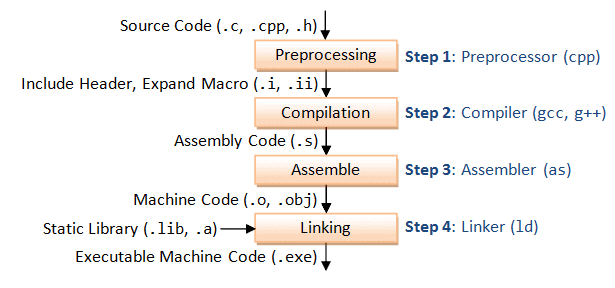
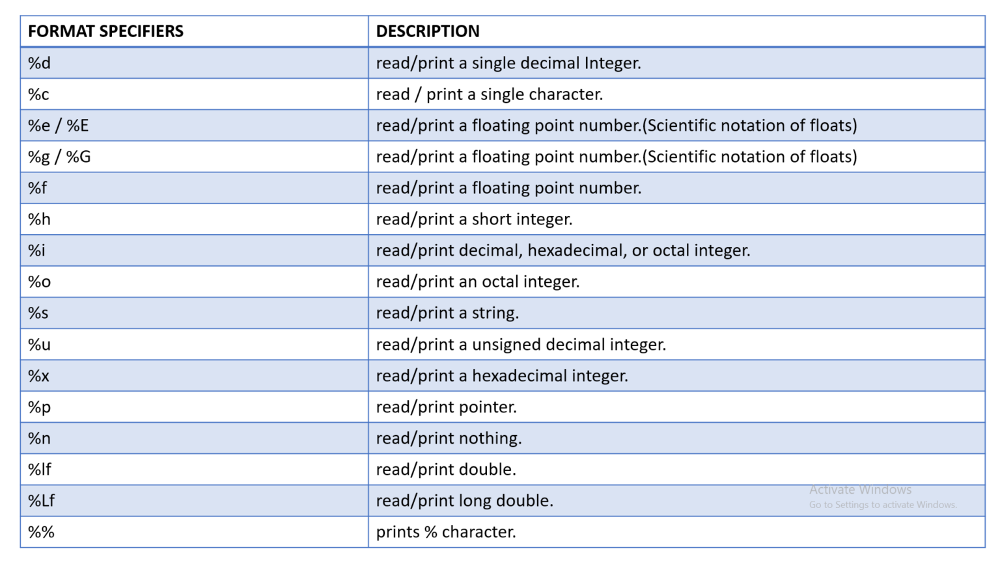
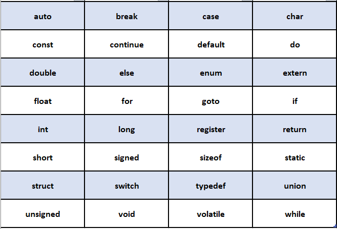
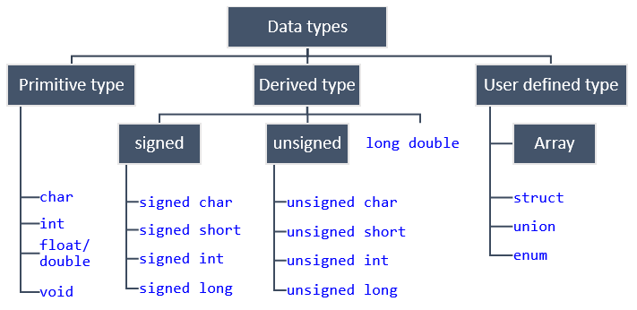
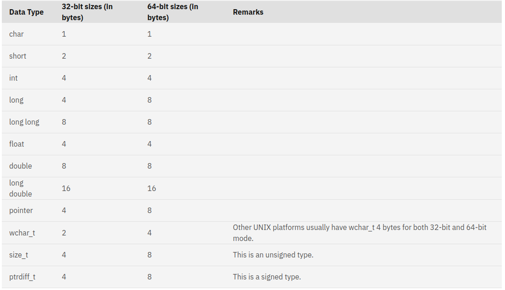
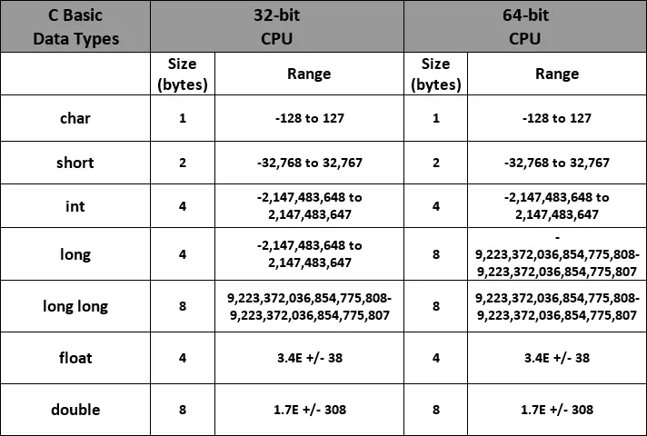
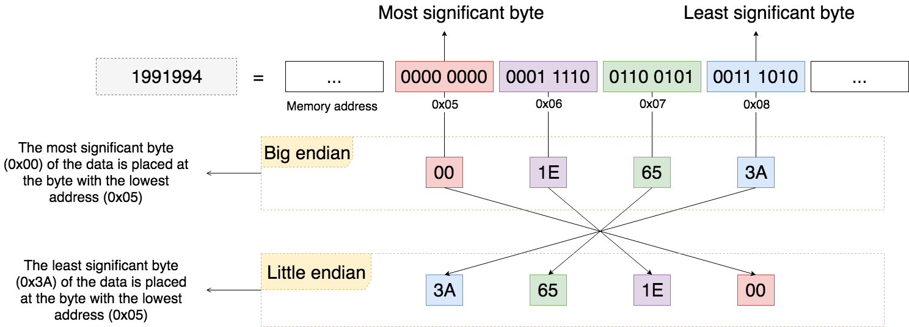
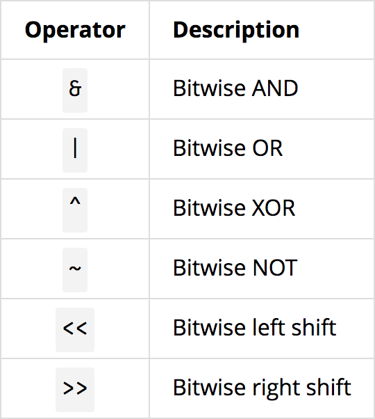
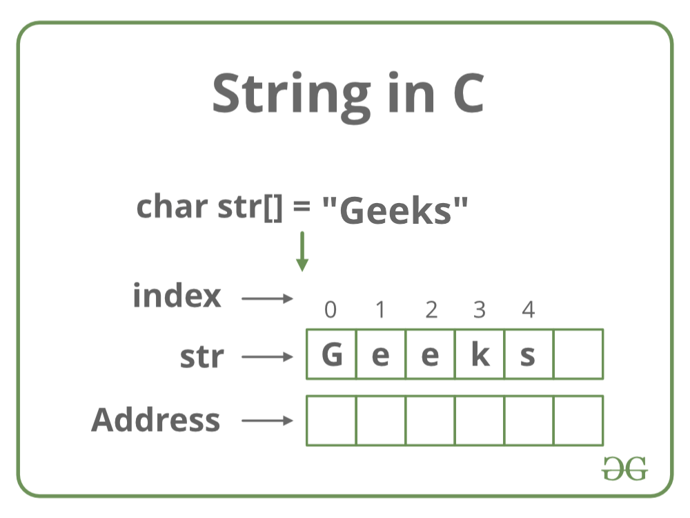

# C Programming
## Overview
1. C language is considered as the mother language of all the modern programming languages because most of the compilers, JVMs, Kernels, etc. are written in C language, and most of the programming languages follow C syntax, for example, C++, Java, C#, etc.
2. C language is a system programming language because it can be used to do low-level programming (for example driver and kernel). It is generally used to create hardware devices, OS, drivers, kernels, etc. For example, Linux kernel is written in C.
3. A procedure is known as a function, method, routine, subroutine, etc. A procedural language specifies a series of steps for the program to solve the problem. A procedural language breaks the program into functions, data structures, etc. C is a procedural language. In C, variables and function prototypes must be declared before being used.
4. A structured programming language is a subset of the procedural language. Structure means to break a program into parts or blocks so that it may be easy to understand. In the C language, we break the program into parts using functions. It makes the program easier to understand and modify.
5. C is considered as a middle-level language because it supports the feature of both low-level and high-level languages. C language program is converted into assembly code, it supports pointer arithmetic (low-level), but it is machine independent (a feature of high-level).
    1. A Low-level language is specific to one machine, i.e., machine dependent. It is machine dependent, fast to run. But it is not easy to understand.
    2. A High-Level language is not specific to one machine, i.e., machine independent. It is easy to understand.
6. The rapid expansion of C working on many different hardware platforms let to many variations that were similar but often incompatiable,
    1. A standard version of c was created (C89/C90, C99, C11)
7. In the past decade or two, many have moved from C to languages such as c++, objective C, and Java. But, C still an Important language in its own right, as well a migration path to these others.

## Facts about C
1. C was invented to write an operating system called UNIX.
2. C is a successor of B language which was introduced around the early 1970s.
3. The language was formalized in 1988 by the American National Standard Institute (ANSI).
4. The UNIX OS was totally written in C.
5. Today C is the most widely used and popular System Programming Language.
6. Most of the state-of-the-art software have been implemented using C.

## The Main feature of C are the following
1. Efficient
2. Portable
3. Powerful and Flexible
4. Programmer Oriented

### Efficiency and Portability
* C is an efficient language<br>
    1. Takes advantage of the capabilities of the current computers
    2. C program are compact and Fast [similar to Assembly language programs]
    3. programmers can fine-tune their programs for maximum speed or most efficient use of memory
* C is a portable language<br>
    1. C programs written on one system can be run on other systems with little or no modifications.
    2. C Compilers are available for many computer architectures.
* Linux/Unix systems typically come with a C Compiler as part of the package
    1. Compilers are available for Personal Computers

 ### Power and Flexibility
 * The Linux/Unix kernel is written in C.
 * Many compilers and interpreters for other language [FORTRAN, Perl, Python, Pascal, LISP, and BASIC] have been written in C.
 * C is Flexible,
    1. Used for developing just about everything you can imagine by way of a computer program
    2. Its a basis for more advanced languages such as C++.

### Programmer Oriented
* C Fulfills the needs of programmers
    1. Gives you access to hardware
    2. Enables you to manipulate individual bits in memory
* C is less strict than most languages in limiting what you can do
    1. You can convert forms of data easily.
    2. Danger is that you can make mistakes [Pointers] that are impossible in some language.
    3. C gives you more freedom, but it also puts more responsiblity on you.

* C implementations have a large libraray of useful C functions

* Programs can be manipulated using bits,
    1. Ability to manage memory representation at bit level
    2. Provides wide variety of bit manipulation operators

* Pointers play a big role in C
    1. Direct access to Memory
    2. Supports efficient use of pointers

## Compilation Process


## Hello World!
```cpp
#include <stdio.h> /*Header file */

int main()
{
    printf("Hello world\n"); /* Print statement */
    return 0;
}
```
```bash
gcc 1.hello_world.c -o hello_world
./hello_world
```

## Basic Concepts
### Comments
* Comments are used in a program to document a program and to enhance the readability.

```c++
/* A program add two integer values
 * and Displays the results */

#include <stdio.h>

int main()
{
    //Declare a variables
    int value1, value2, sum;

    //Assign values and calculate their sum
    value1 = 10;
    value2 = 20;
    sum = value1 + value2;

    //Display the result
    printf("The sum of %d and %d is %d\n", value1, value2, sum);

    return 0;

}
```

### The preprocessor
* The C Preprocessor is not a part of the compiler, but is a separate step in the compilation process. In simple terms, a C Preprocessor is just a text substitution tool and it instructs the compiler to do required pre-processing before the actual compilation. All preprocessor commands begin with a hash symbol (#). It must be the first nonblank character, and for readability, a preprocessor directive should begin in the first column.

* We will utilize the preprocessor to:
    1. Create a constant and macros with the #define statement
    2. Build your own lib or header files and include them with #include statement
    3. Make powerful programs with the conditional #ifdef, #endif, #else, and #ifndef statement.

```c++
#include <stdio.h>
#define VALUE1 10 //user defined Macros
#define VALUE2 20

int main()
{
    int sum;

    sum = VALUE1 + VALUE2;

    //Display the result
    printf("The sum of %d and %d is %d\n", VALUE1, VALUE2, sum);

    printf("Time :%s\n", __TIME__ ); //Predefined Macros
    printf("Line :%d\n", __LINE__ ); //Predefined Macros
    return 0;

}
```

### Display output
* Printf() is a standard library function and it outputs the information to the commandline [the standard output stream, which is the command line by default]



```c++
#include <stdio.h>

int main()
{
    int a = 10;
    float b = 20.08f;
    
    printf("Value a: %d and b:%d\n", a, b);
    return 0;
}
```
```
Value a: 10 and b:-455185576
```

```C++
#include <stdio.h>

int main()
{
    int a = 10;
    float b = 20.08f;
    
    printf("Value a: %d and b:%f\n", a, b);
    return 0;
}
```
```
Value a: 10 and b:20.080000
```

### Reading Input from the terminal
* The C lib contains several input functions, and scanf() is the most general of them and it can read a variety of formats.
* Reads the input from the standard input stream <b>stdin</b> and scans that input according to the format provided,
```c++
#include <stdio.h>

int main()
{
    unsigned int h_i, w_i;
    
    printf("Enter heigh and width of the image:\n");
    scanf("%u%u", &h_i, &w_i);
    printf("h_i:%u w_i:%u \n", h_i, w_i);
    return 0;
}
```

### Command Line Arguments
It is possible to pass some values from the command line to your C programs when they are executed. These values are called command line arguments and many times they are important for your program especially when you want to control your program from outside instead of hard coding those values inside the code.

The command line arguments are handled using main() function arguments where argc refers to the number of arguments passed, and argv[] is a pointer array which points to each argument passed to the program.

```c++
#include <stdio.h>
#include <stdlib.h>
/* atoi - The C library function int atoi(const char *str) converts the string * argument str to an integer (type int). */
int main( int argc, char *argv[] )  
{
    int h_i, h_w;
    if( argc > 1 ) {
        printf("The argument supplied is %s\n", argv[1]);
        printf("The argument supplied is %s\n", argv[2]);
        h_i = atoi(argv[1]);
        h_w = atoi(argv[2]);
    }
    else if( argc > 2 ) {
        printf("Too many arguments supplied.\n");
    }
    else {
        printf("One argument expected.\n");
    }
    printf("h_i:%d h_w:%d\n", h_i, h_w);
}
```

## Variables and Data Types
* The program needs to store the instructions of its program and the data it acts upon while your computer is executing the program.
    1. The information is stored in memory (RAM)
    2. RAM's contents are lost when the computer is turned off.
    3. Hard drives store persistent data
    4. All the value stored in binary representation.

* Bits in memory are grouped into set of eights(byte)
* Each byte has been labeled with a number (address)
* The address of a byte uniquely references that byte in our computer memory.

<b> variables are the namees we give to computer memory locations which are used to store value in a computer program.</b>

### Naming Variables
* The rule for naming variables in C is that all names must begin with a letter or underscore(_) and can be followed by any combination of letters

```bash
file_name 
i 
j5_7
_private_var
```

* Invalid variable names
```bash
temp$value - $ is not valide
image name - space not permitted
int - int is a reserved keyword
```
### Reserved keywords


* Data types represents a type of the data which you can process using your program.
    1. examples include ints, floats, doubles, etc.
    2. also correspind to byte size on the platform of your program



<b> variable declaration </b>:
```bash
type-specifier variable_name;
type-specifier variable_name = value;
```
C require that all program variables be declared before they are used in a proggram.

```c++
int x;
int y = 10;
int a = 10, b = 20, c = 30;
char a[] = "abcd";
char b[50] = "abcd";
char c[] = {'a', 'b', 'c', 'd', '\0'};
```

```c++
char c[100];
c = "C programming";  // Error! array type is not assignable.
```

* Some example of basic data types in C are,
    1. int
    2. float
    3. double
    4. char
    5. _bool
* The difference between the types in the amount of memory they ccupy and the range of the values they can hold
    1. The amount of storage that is allocated to store a particular type of data
    2. depend on the platform type [32 bit or 64 bit]




```c++
#include <stdio.h>

int main(){
    int integerVal = 100;
    float floatingVar = 300.11;
    double doubleVar = 8.44e+11;
    _Bool boolVar = 0;
    bool flag = true;
    return 0;
}
```

* C offers three adjective keywords to modify the basic integer type(can also be used by itself)
    1. short
    2. long
    3. unsigned


## Operators


```c++
#include <stdio.h>

int main()
{
    /* Arithmetic Operators */
    int a = 20, b = 10;
    printf("Add :%d \n", a + b); //30
    printf("Sub:%d \n", a - b);  //10
    printf("MUl:%d \n", a * b);  //200
    printf("Division:%d \n", a / b); //2
    printf("Reminder:%d \n", a % b); //0
    printf("Preincrement:%d \n", ++a); //21
    printf("Postincrement:%d \n", a++); // The value remain same as previous one..why?
    printf("a value after Post incre:%d \n", a); //22
    printf("Predecrement:%d \n", --a); //21
    printf("Postdecrement:%d \n", a--); //21

    /* Logical Operators */
    int c = 0;
    if ( a && b){  // AND operator
        printf("The condition is true \n"); //This Print
    }
    
    if ( c && b)
    {
        printf("The condition is true \n");
    } else {
        printf("The condition is False\n"); //This Print
    }

    if ( c || b)  // OR Operator
    {
        printf("The condition is true\n"); //This Print
    } else {
        printf("The condition is False\n");
    } 

    if (!c)     // NOT operator
    {
        printf("The condition is true\n"); //This Print
    }
    
    /* Assignment Operator */
    c = 10; // Assignment Opertor
    c += 10; // Add AND 
    printf("Add AND:%d \n", c); //20

    c -= 10; // Sub AND 
    printf("Sub AND:%d \n", c); //10
    
    return 0;
}

```
### bitwise Operators




## Control Flow
1. Decision Making Statements [if-then, if-then-else, switch, goto]
2. Looping Statments [for, while, do-while]
3. Branching Statements [break, continue, return]

### Decision Making Statements
```c++
#include <stdio.h>
 
int main () {

   /* local variable definition */
   int a = 10;
 
   /* check the boolean condition using if statement */
	
   if( a < 20 ) {
      /* if condition is true then print the following */
      printf("a is less than 20\n" );
   }
   
   printf("value of a is : %d\n", a);
 
   return 0;
}
```

```c++
#include <stdio.h>
 
int main () {

   /* local variable definition */
   int a = 100;
 
   /* check the boolean condition */
   if( a < 20 ) {
      /* if condition is true then print the following */
      printf("a is less than 20\n" );
   } else {
      /* if condition is false then print the following */
      printf("a is not less than 20\n" );
   }
   
   printf("value of a is : %d\n", a);
 
   return 0;
}
```

```c++
#include <stdio.h>
 
int main () {

   /* local variable definition */
   int a = 100;
   int b = 200;
 
   /* check the boolean condition */
   if( a == 100 ) {
   
      /* if condition is true then check the following */
      if( b == 200 ) {
         /* if condition is true then print the following */
         printf("Value of a is 100 and b is 200\n" );
      }
   }
   
   printf("Exact value of a is : %d\n", a );
   printf("Exact value of b is : %d\n", b );
 
   return 0;
}
```

```c++
#include <stdio.h>
 
int main () {

   /* local variable definition */
   char grade = 'B';

   switch(grade) {
      case 'A' :
         printf("Excellent!\n" );
         break;
      case 'B' :
      case 'C' :
         printf("Well done\n" );
         break;
      case 'D' :
         printf("You passed\n" );
         break;
      case 'F' :
         printf("Better try again\n" );
         break;
      default :
         printf("Invalid grade\n" );
   }
   
   printf("Your grade is  %c\n", grade );
 
   return 0;
}
```

```c++
#include <stdio.h>
 
int main () {

   /* local variable definition */
   int a = 100;
   int b = 200;
 
   switch(a) {
   
      case 100: 
         printf("This is part of outer switch\n", a );
      
         switch(b) {
            case 200:
               printf("This is part of inner switch\n", a );
         }
   }
   
   printf("Exact value of a is : %d\n", a );
   printf("Exact value of b is : %d\n", b );
 
   return 0;
}
```

### Looping Statments

```c++
#include <stdio.h>
 
int main () {

   /* local variable definition */
   int a = 10;

   /* while loop execution */
   while( a < 20 ) {
      printf("value of a: %d\n", a);
      a++;
   }
 
   return 0;
}
```

```c++
#include <stdio.h>
 
int main () {

   int a;
	
   /* for loop execution */
   for( a = 10; a < 20; a = a + 1 ){
      printf("value of a: %d\n", a);
   }
 
   return 0;
}
```

```c++
#include <stdio.h>
 
int main () {

   /* local variable definition */
   int a = 10;

   /* do loop execution */
   do {
      printf("value of a: %d\n", a);
      a = a + 1;
   }while( a < 20 );
 
   return 0;
}
```

### Branching Statements
```c++
#include <stdio.h>
 
int main () {

   /* local variable definition */
   int a = 10;

   /* while loop execution */
   while( a < 20 ) {
   
      printf("value of a: %d\n", a);
      a++;
		
      if( a > 15) {
         /* terminate the loop using break statement */
         break;
      }
   }
 
   return 0;
}
```

```c++
#include <stdio.h>
 
int main () {

   /* local variable definition */
   int a = 10;

   /* do loop execution */
   do {
   
      if( a == 15) {
         /* skip the iteration */
         a = a + 1;
         continue;
      }
		
      printf("value of a: %d\n", a);
      a++;
   
   } while( a < 20 );
 
   return 0;
}
```

```c++
#include <stdio.h>
 
int main () {

   /* local variable definition */
   int a = 10;

   /* do loop execution */
   LOOP:do {
   
      if( a == 15) {
         /* skip the iteration */
         a = a + 1;
         goto LOOP;
      }
		
      printf("value of a: %d\n", a);
      a++;

   }while( a < 20 );
 
   return 0;
}
```

## Arrays
* The Data item in an array are referred to as elements
* The elements in an array have to be the same type (int, long, double, etc )
```c++
// Declaration
long image_IDs[100];
/* Thye numbers between square brackets defines how many elements the
array contains.
*/

// Accessing an array elements
image_IDs[0]; // Access the zero element array

/* In C, the array index start from 0....*/

/* Its very command to use a loop to access each elements in an arry*/
```


```c++
#include <stdio.h>

#define MONTHS 12
int main()
{
    int days[MONTHS] = {31, 28, 31, 30, 31, 30, 31, 31, 30, 31, 30, 31};
    int index;

    for (index = 0; index < MONTHS; index++)
    {
        printf("Month %d has %d days\n", index+1, days[index]);
    }
    return 0;
}
```

```c++
#include <stdio.h>

#define H 5
#define W 5

int main()
{
    int image[H][W];
    for (int i = 0; i < H; i++)
    {
        for (int j = 0; j < W; j++)
        {
            image[i][j] = rand()%10;
        }
    }

    for (int i = 0; i < H; i++)
    {
        for (int j = 0; j < W; j++)
        {
            printf("%d ", image[i][j]);
        }
        printf("\n");
    } 

    int image_temp[2][2] = { {1, 2},
                             {3, 4}};
    
    for (int i = 0; i < 2; i++)
    {
        for (int j = 0; j < 2; j++)
        {
            printf("%d ", image_temp[i][j]);
        }
        printf("\n");
    } 
    
    return 0;   
} 
```
## Function
* A function in C is the same as subroutines or procedures in other programming Language
```c++
void function(); // Function declaration

void function(){ // Function Definition
    // Code here
}
/* The block of code between braces following the function header
is called the function body */
```

```c++
syntax:
Return_type Function_name(parameters - separated by commas)
{
    //Code Here
}

/* If the functions doesn't return any value then it use Void*/
```

```c++

void function()
{
    //code here
}

int main()
{
    function();
    return 0;
}

/* This doesn't need a definition/prototype declaration
```

```c++
void function();
int main()
{
    function();
}

void function()
{
    //code here
}

/* This need a definition/prototype declaration
```

### Arguments and Parameters
1. A parameter is a variable in a function declaration and function
   definition/implementation
2. When a function is called, the arguments are the data you pass into the functions parameters.

```c++
void function(int a, int b) // Here a and b is Param
{

}

int x = 10;
int y = 20;

function(x, y); // Here x and y is arguments
```

### Return values

```c++
int add(int a, int b)
{
    return a+b;
}

int addition_val = add(10, 20);
```

Note: Functions and arguments are stored in Stack in the program memory...

## String

* A string constant or stringlieral is a sequence of characters or symbols
  between a pair of double-quote characters
```c++
char name[] = "Geeks";
char name[5] = "Geeks";
char name[5] = {'G', 'e', 'e', 'k', 's'};

/* String always terminates with \0*/

/* Note C has no special variable type for string like C++ */
/* Strings in C are stored in an array of type char*
``` 

```c++
char string[5] = "hello";
size_t length = strlen(string);
size_t i = 0; 
for (; i < length; i++) {
    printf("%c\n", string[i]);    /* Print each character of the string. */
}
```

In-build String Functions,


